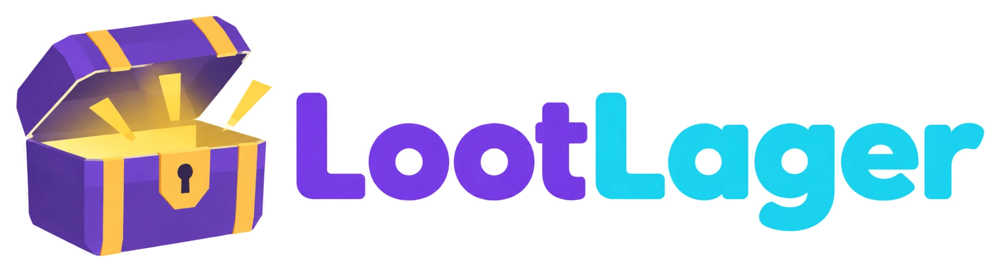

# Projektplanung – Gründung unseres Onlineshops

> **Aufgabe (laut Tafel):** 5 Gruppen · Logo (KI) · Firmenname · Rechtsform · Suche vom Anbieter · Präsentation (1. Folie …)
>
> Tafel-Skizze: *Suche Anbieter → HP* – wir suchen einen Anbieter, mit dem wir unsere Homepage bzw. unseren Onlineshop bauen.
>
> **Die Gründung ist fiktiv** und nur für das Fach E-Commerce. Wir melden nichts an, prüfen keine Register und bezahlen nichts.

## ⏰ Jetzt dran: Folie 1 – Abgabe nächste Stunde, 13:45 Uhr

Die Lehrkraft hat gesagt:
- **Folie 1 ist der Anfang der Präsentation.** Darauf müssen stehen: **Firmenlogo, Firmenname, Rechtsform.**
- Zusätzlich überlegen wir uns einen **Markennamen**. Er darf genauso heißen wie die Firma.
- Die Lehrkraft lässt **irgendein Gruppenmitglied** vorstellen und fragt nach, z. B. **„Warum habt ihr diese Rechtsform gewählt?“**. Deshalb muss **jede und jeder** die Begründung können (siehe [Spickzettel](#spickzettel-fragen-der-lehrkraft-zur-rechtsform)).
- Bis nächste Stunde 13:45 Uhr ist das unsere Aufgabe. In der nächsten Stunde gibt es noch **15 Minuten extra**, um alles zusammenzustellen.
- **Danach** wählen wir den Webshop-Anbieter aus (Abschnitt 5).

**To-do bis 13:45 Uhr:**
- [x] Geschäftsidee festlegen (Abschnitt 1)
- [x] Firmenname + Markenname festlegen (Abschnitt 2)
- [x] Rechtsform festlegen (Abschnitt 3)
- [x] Geschäftsführung bestimmen → Nick und Luca
- [x] Logo mit ChatGPT erstellen → [`assets/logo-lootlager.png`](assets/logo-lootlager.png)
- [x] Folie 1 bauen → [`praesentation/LootLager_Praesentation.pptx`](praesentation/LootLager_Praesentation.pptx)
- [x] Auf Folie 1 Gruppennummer und Namen eintragen → Gruppe 4, Nick und Luca (Gruppennummer bitte noch einmal prüfen)
- [ ] Nick und Luca können beide die Spickzettel (Abschnitte 2 und 3)

**Phase 2 (danach):**
- [x] Webshop-Anbieter auswählen → **Shopify** (Nutzwertanalyse in Abschnitt 5)
- [x] Homepage-Entwurf → Abschnitt 6 und Folie 6
- [x] Folien 5–7 bauen (Anbietersuche, Entscheidung + Startseite, Fazit + Quellen)
- [x] Rollen verteilen → Vorschlag in Abschnitt 8

**Erledigt, weil die Gründung fiktiv ist:**
- [x] Namensprüfung in Handelsregister, DPMA, Domain und Social Media → wir nehmen an, dass alles frei ist (Abschnitt 2)
- [x] Preise auf den Anbieterseiten gegenprüfen → die Preise aus den Preisvergleichen reichen (Abschnitt 5)

**Was ihr selbst noch machen müsst:**
- [ ] Spickzettel lernen: Name (Abschnitt 2), Rechtsform (Abschnitt 3) und Anbieter (Abschnitt 5)
- [ ] Probelauf mit Stoppuhr, danach Rollen in Abschnitt 8 bestätigen

---

## ✅ Unsere Firma auf einen Blick

| | |
|---|---|
| **Firmenname** | **LootLager UG (haftungsbeschränkt)** |
| **Markenname** | **LootLager** (gleich wie die Firma) |
| **Rechtsform** | **Unternehmergesellschaft (haftungsbeschränkt)** |
| **Slogan** | „Level up dein Setup.“ |
| Was wir verkaufen | Gaming-Zubehör mit **Custom Designs**: XXL-Mauspads, Controller-Skins, Custom Keycaps, LED-Schilder |
| Zielgruppe | Gamer und Streamer, 16–30 Jahre |
| Was uns besonders macht | Jedes Produkt mit eigenem Design: Kunden laden ihr Motiv hoch oder lassen es von uns gestalten. Schneller Versand aus Deutschland |
| Gruppe | Gruppe 4: Nick und Luca |
| Gesellschafter | Nick und Luca, je 50 % |
| Stammkapital | 1.000 € (fiktiv), je 500 € von Nick und Luca |
| Geschäftsführung | Nick und Luca (gemeinsam) |
| Shopsystem | **Shopify**, Basic-Tarif (siehe Abschnitt 5) |
| Domain | `lootlager.de` (fiktiv, wir nehmen an, dass sie frei ist) |
| Farben | Violett `#7C3AED` · Türkis `#22D3EE` · Dunkelblau `#111827` |

**Was der Name bedeutet:** „Loot“ ist in Videospielen die Beute, also die Belohnung, die man findet. „Lager“ steht für unseren Shop, in dem alles bereitliegt. **LootLager ist das Lager voller Beute für dein Gaming-Setup.** Das doppelte L macht den Namen leicht merkbar.

---

## 0. Überblick – Arbeitspakete

| # | Arbeitspaket | Ergebnis | Verantwortlich | Status |
|---|---|---|---|---|
| 1 | Geschäftsidee | Sortiment + Zielgruppe in einem Satz | Nick und Luca | ✅ |
| 2 | Firmenname | Name inkl. Rechtsformzusatz, geprüft | Nick und Luca | ✅ (fiktiv: Name ist frei) |
| 3 | Rechtsform | Entscheidung + Begründung | Nick und Luca | ✅ |
| 4 | Logo (KI) | Logo als PNG, Tool + Prompt notiert | Nick und Luca | ✅ |
| 5 | Anbietersuche | Vergleich von 3–4 Shopsystemen + Entscheidung | Nick und Luca | ✅ Shopify |
| 6 | Homepage-Entwurf | Skizze der Startseite | Nick und Luca | ✅ |
| 7 | Präsentation | Foliensatz + ein Probelauf | Nick und Luca | ◐ Folien fertig, Probelauf offen |

**Reihenfolge:** 1 → 2 und 3 parallel → 4 → 5 → 6 → 7
(Das Logo kommt erst nach dem Namen, weil der Name meist im Logo steht.)

**Phase 1 (bis nächste Stunde 13:45 Uhr):** Pakete 1–4 → Folie 1
**Phase 2 (danach):** Pakete 5–7 → Webshop-Anbieter auswählen, restliche Folien

---

## 1. Geschäftsidee

Leitfragen: *Was verkaufen wir? An wen? Warum bei uns und nicht bei Amazon?*

| Idee | Sortiment | Zielgruppe | Namensideen |
|---|---|---|---|
| Nachhaltiger Alltag | Trinkflaschen, Brotdosen, feste Seife, Bienenwachstücher | Umweltbewusste, 18–35 | Grünstück, Kreislauf & Co. |
| Gaming-Zubehör | Mauspads, Headset-Halter, LED-Leisten, Kabelmanagement | Gamer, 14–30 | PixelPort, Levelgear |
| Kaffee & Zubehör | Spezialitätenkaffee, Handfilter, Mühlen | Kaffeeliebhaber, 25–50 | Bohnenwerk, Röstpunkt |
| Sneaker-Pflege | Reinigungssets, Imprägnierspray, Schnürsenkel | Sneaker-Fans, 16–35 | SoleCare, Frischsohle |

Die Namen sind nur Startpunkte. Ob es sie schon gibt, prüfen wir in Abschnitt 2.

**Unsere Entscheidung:** Gaming-Zubehör mit Custom Designs. Gamer und Streamer (16–30) bekommen bei uns Zubehör mit ihrem eigenen Design, selbst hochgeladen oder von uns gestaltet.

---

## 2. Firmenname

**Rechtliche Anforderungen (HGB / GmbHG):**
- Der Name muss **unterscheidungskräftig** sein und darf **nicht irreführen** (§ 18 HGB).
- Der **Rechtsformzusatz** ist Pflicht (§ 19 HGB, § 4 bzw. § 5a GmbHG), z. B. „… GmbH“ oder „… UG (haftungsbeschränkt)“.

**Ein guter Shop-Name ist:** kurz, leicht zu buchstabieren, passend zum Sortiment und als Domain noch frei.

**Prüf-Checkliste:**
- [x] Handelsregister – gibt es die Firma schon? → fiktiv: nein. Echt prüfen würde man auf [handelsregister.de](https://www.handelsregister.de), „Normale Suche“, Firma: `LootLager`
- [x] Marken – ist der Name geschützt? → fiktiv: nein. Echt prüfen würde man im [DPMAregister](https://register.dpma.de/DPMAregister/marke/basis) und in [EUIPO eSearch](https://euipo.europa.eu/eSearch/)
- [x] Domain – ist `lootlager.de` frei? → fiktiv: ja. Echt prüfen würde man bei der [DENIC](https://www.denic.de/service/whois-service)
- [x] Social Media – sind Instagram- und TikTok-Namen frei? → fiktiv: ja (`@lootlager`)
- [x] Kurze Websuche nach dem Namen (06.10.2026: kein Shop „LootLager“ gefunden)

> **Fiktive Gründung:** Unser Shop ist ein Projekt für das Fach E-Commerce. Deshalb prüfen wir die Register nicht echt, sondern **nehmen an, dass Firmenname, Marke, Domain und Social-Media-Namen frei sind**. In der Präsentation erklären wir trotzdem, wo man das prüfen würde (siehe Spickzettel unten).

**Vollständiger Firmenname:** `LootLager UG (haftungsbeschränkt)`

### Firmenname oder Markenname – was ist der Unterschied?

| | Firmenname (Firma) | Markenname (Marke) |
|---|---|---|
| Was ist das? | Der **rechtliche Name des Unternehmens**, unter dem es Geschäfte macht (§ 17 HGB) | Ein **Kennzeichen für Produkte**, das sie von denen anderer Anbieter unterscheidet (§ 3 MarkenG) |
| Wo steht er? | im Handelsregister, Impressum, auf Rechnungen und Verträgen | auf Produkten, Verpackungen, im Shop und in der Werbung |
| Rechtsformzusatz? | **ja, Pflicht** (z. B. „UG (haftungsbeschränkt)“) | nein |
| Schutz | durch Eintrag ins Handelsregister | durch Eintragung beim DPMA, 10 Jahre, verlängerbar |
| Beispiel | Henkel AG & Co. KGaA | Persil |
| Beispiel | dm-drogerie markt GmbH + Co. KG | Balea |

**Für uns:** Die Marke heißt genauso wie die Firma, nur ohne Rechtsformzusatz. Das ist laut Lehrkraft ausdrücklich in Ordnung.

**Unser Markenname:** `LootLager`

### Spickzettel: Fragen zu Name, Marke und Logo

**„Warum heißt ihr LootLager?“**
> „Loot“ ist in Videospielen die Beute, die man als Belohnung bekommt. „Lager“ steht für unseren Shop, in dem alles für dein Gaming-Setup bereitliegt. Der Name ist kurz, passt zu unserer Zielgruppe und ist durch das doppelte L leicht zu merken.

**„Was ist der Unterschied zwischen Firma und Marke?“**
> Die Firma ist der rechtliche Name unseres Unternehmens. Sie steht im Handelsregister und enthält die Rechtsform: LootLager UG (haftungsbeschränkt). Die Marke ist der Name, unter dem die Kunden unseren Shop und unsere Produkte kennen: LootLager. Bei uns heißen beide gleich, so erkennt man uns leichter wieder.

**„Was bedeutet euer Logo?“**
> Die Truhe ist eine Loot-Kiste wie in Videospielen: Wer bei uns bestellt, bekommt seine Belohnung. Violett und Türkis sind typische Gaming-Farben. Das Logo haben wir mit ChatGPT erstellt.

**„Habt ihr geprüft, ob es den Namen schon gibt?“**
> Unsere Gründung ist fiktiv, deshalb nehmen wir an, dass der Name frei ist. Eine kurze Websuche hat keinen Shop „LootLager“ gefunden. Bei einer echten Gründung würden wir im Handelsregister nach der Firma suchen, beim DPMA nach der Marke und bei der DENIC nach der Domain lootlager.de.

---

## 3. Rechtsform

| Rechtsform | Gründer | Mindestkapital | Haftung | Für uns? |
|---|---|---|---|---|
| Einzelunternehmen | 1 | keins | unbeschränkt, mit Privatvermögen | ✗ wir sind zu zweit |
| GbR | ≥ 2 | keins | unbeschränkt, persönlich, jeder für alles | ✗ zu riskant |
| OHG | ≥ 2 | keins | unbeschränkt, persönlich | ✗ zu riskant |
| KG | ≥ 2 | keins | Komplementär unbeschränkt, Kommanditist bis zur Einlage | ~ möglich, aber ungleich |
| **GmbH** | ≥ 1 | 25.000 € (mind. 12.500 € bei Anmeldung eingezahlt) | nur Gesellschaftsvermögen | ✓ |
| **UG (haftungsbeschränkt)** | ≥ 1 | ab 1 €, komplett bar einzuzahlen | nur Gesellschaftsvermögen | ✓ |
| AG | ≥ 1 | 50.000 € | nur Gesellschaftsvermögen | ✗ zu aufwendig |

### Unsere Wahl: UG (haftungsbeschränkt)

**Argumente für die Präsentation:**
1. **Beschränkte Haftung** – Risiken im Onlinehandel (Abmahnungen, Retouren, unverkaufte Lagerware) treffen nicht unser Privatvermögen.
2. **Geringes Startkapital** – realistisch für Gründer ohne großes Vermögen.
3. **Zwei Gesellschafter** – Nick und Luca halten je 50 % und führen gemeinsam die Geschäfte.
4. **Wachstum möglich** – später Umwandlung in eine GmbH, sobald 25.000 € Stammkapital erreicht sind.

**Nachteile (ehrlich nennen – das macht die Präsentation stärker):**
- 25 % des Jahresüberschusses müssen in eine Rücklage (§ 5a Abs. 3 GmbHG).
- Notar und Handelsregister kosten Gebühren.
- Bei Lieferanten und Banken gilt die UG als weniger kreditwürdig als eine GmbH.

**Alternative:** Eine **GmbH**, wenn wir mit fiktivem Startkapital ab 25.000 € planen, denn sie wirkt seriöser.

### Spickzettel: Fragen der Lehrkraft zur Rechtsform

Jedes Gruppenmitglied muss diese Antworten in eigenen Worten sagen können.

**„Warum habt ihr die UG gewählt?“**
> Wir sind zwei Gründer und wollen nicht mit unserem Privatvermögen haften. Für eine GmbH fehlen uns aber die 25.000 € Stammkapital. Die UG gibt uns die beschränkte Haftung schon ab 1 € Stammkapital.

**„Was heißt ‚haftungsbeschränkt‘?“**
> Wenn die Firma Schulden hat, haftet nur das Vermögen der Gesellschaft. Unser privates Geld ist geschützt.

**„Warum keine GmbH?“**
> Für eine GmbH braucht man 25.000 € Stammkapital, bei der Anmeldung mindestens 12.500 €. Das haben wir als junge Gründer nicht. Sobald die UG 25.000 € Stammkapital hat, können wir sie zur GmbH machen.

**„Warum keine GbR oder OHG?“**
> Dort haftet jeder Gesellschafter unbeschränkt mit seinem Privatvermögen, und zwar auch für die Schulden der anderen. Im Onlinehandel ist das zu riskant, z. B. bei Abmahnungen oder wenn wir auf Ware sitzen bleiben.

**„Warum kein Einzelunternehmen?“**
> Ein Einzelunternehmen hat nur einen Inhaber, wir sind aber zu zweit. Außerdem haftet der Inhaber unbeschränkt.

**„Hat die UG auch Nachteile?“**
> Ja. Wir müssen jedes Jahr 25 % vom Gewinn zurücklegen, bis wir 25.000 € erreicht haben. Für die Gründung brauchen wir einen Notar und den Eintrag ins Handelsregister, das kostet Geld. Und manche Lieferanten und Banken vertrauen einer UG weniger als einer GmbH.

**„Wie viel Stammkapital habt ihr und wer sind die Gesellschafter?“**
> Unser Stammkapital beträgt 1.000 €. Nick und Luca sind die Gesellschafter und zahlen je 500 € ein.

**„Wer führt die Geschäfte?“**
> Wir beide: Nick und Luca sind gemeinsam Geschäftsführer. Die Geschäftsführung bestimmen die Gesellschafter, und das sind bei uns auch wir zwei.

**„Wie gründet man eine UG?“**
> Gesellschaftsvertrag beim Notar beurkunden lassen → Stammkapital einzahlen → Eintrag ins Handelsregister → Gewerbe anmelden → beim Finanzamt anmelden.

---

## 4. Logo (KI)

### Unser Logo ✅



Dateien: [`assets/logo-lootlager.png`](assets/logo-lootlager.png) (komplett) und [`assets/logo-lootlager-symbol.png`](assets/logo-lootlager-symbol.png) (nur die Truhe, z. B. als App-Icon)

**Tool:** ChatGPT. Falls das Bild-Limit erreicht ist, geht derselbe Prompt auch in Microsoft Copilot.

### Unser Prompt für ChatGPT (komplett kopieren und einfügen)

```text
Erstelle ein Logo für unseren Onlineshop „LootLager“.
Wir verkaufen Gaming-Zubehör (Mauspads, Headset-Halter, LED-Leisten,
Controller-Ständer) an Gamer und Streamer zwischen 16 und 30 Jahren.

Symbol: eine stilisierte, leicht geöffnete Schatztruhe wie eine
„Loot-Kiste“ aus Videospielen, aus der helles Licht nach oben strahlt.
Schriftzug: „LootLager“ rechts neben dem Symbol, in einer fetten,
abgerundeten, modernen Schrift. „Loot“ in Violett (#7C3AED),
„Lager“ in Türkis (#22D3EE).

Stil: flaches Vektor-Design, klare Formen, wenige Details,
modern und verspielt, aber professionell.
Hintergrund: reines Weiß.
Das Symbol muss auch ganz klein (als App-Icon) erkennbar sein.
Kein Fotorealismus, kein 3D, kein Slogan, kein weiterer Text,
keine Wasserzeichen. Schreibe den Namen genau so: LootLager
```

### Folge-Prompts (danach im selben Chat eingeben)

| Wenn … | dann eingeben: |
|---|---|
| der Name falsch geschrieben ist | `Der Schriftzug ist falsch. Schreibe exakt: LootLager (L-o-o-t-L-a-g-e-r). Sonst nichts ändern.` |
| ihr eine andere Variante wollt | `Erstelle eine Variante mit denselben Farben, aber die Truhe im Pixel-Art-Stil wie in einem Retro-Videospiel.` |
| ihr eine dunkle Version wollt | `Erstelle dasselbe Logo auf dunklem Hintergrund (#111827) mit leichtem Neon-Leuchten um Symbol und Schrift.` |
| ihr nur das Symbol braucht | `Erstelle nur das Truhen-Symbol ohne Schrift, quadratisch, als App-Icon.` |
| der Hintergrund weg soll | `Gib mir das Logo als PNG mit transparentem Hintergrund.` |

Klappt der transparente Hintergrund nicht, entfernt ihr ihn in PowerPoint: Bild anklicken → **Bildformat** → **Freistellen**.

**Tipps:**
- KI schreibt Text oft fehlerhaft. Im Zweifel nur das **Symbol** generieren und den Schriftzug selbst in Canva oder PowerPoint setzen.
- 3–5 Varianten erzeugen und in der Gruppe abstimmen.
- **Tool und Prompt notieren**, denn beides gehört in die Präsentation.
- Rein KI-generierte Bilder sind in Deutschland mangels menschlicher Schöpfung meist **nicht urheberrechtlich geschützt**. Ein echtes Unternehmen würde das Logo deshalb als Marke anmelden. Außerdem gelten die Nutzungsbedingungen des Tools.

**Logo-Check (07.10.2026):**
- [x] Funktioniert es auch in Schwarz-Weiß? → Ja. Truhe und Schriftzug bleiben lesbar. In Graustufen ist „Lager“ etwas heller als „Loot“.
- [x] Ist es in kleiner Größe (z. B. als Browser-Tab-Icon) noch erkennbar? → Das Truhen-Symbol ist bei 32 px gut erkennbar, bei 16 px nur noch grob. Als Tab-Icon deshalb nur das Symbol verwenden, nicht das ganze Logo.
- [x] Passt es zu Name und Zielgruppe? → Ja. Die Loot-Truhe greift den Namen auf, Violett und Türkis sind typische Gaming-Farben.

---

## 5. Anbietersuche – Shopsystem für unsere Homepage

### Kandidaten

| Anbieter | Typ | Sitz | Stärken | Schwächen |
|---|---|---|---|---|
| Shopify | Mietshop (SaaS) | Kanada | sehr einfach, viele Designs & Apps, schnell startklar | monatliche Kosten, ggf. Transaktionsgebühren, Daten teils außerhalb der EU |
| Shopware 6 | Open Source / Cloud | Deutschland | auf den deutschen Markt und deutsches Recht ausgelegt, skalierbar | komplexer, beim Selbst-Hosting ist Technikwissen nötig |
| WooCommerce | Plugin für WordPress | USA (Automattic) | Grundversion kostenlos, sehr flexibel, Plugins für deutsches Recht | Hosting, Updates und Sicherheit müssen wir selbst übernehmen |
| Wix | Homepage-Baukasten mit Shop | Israel | Drag & Drop, sehr anfängerfreundlich | für große Shops wenig flexibel, späterer Wechsel aufwendig |
| Jimdo | Homepage-Baukasten mit Shop | Deutschland (Hamburg) | einfach, deutschsprachig, günstig | eingeschränkter Funktionsumfang |
| JTL-Shop | Shopsoftware | Deutschland | stark in Kombination mit der Warenwirtschaft JTL-Wawi | eher für wachsende Händler |

### Preise (Stand 07.10.2026)

| Anbieter | Tarif für uns | Preis pro Monat | Was noch dazukommt |
|---|---|---|---|
| Shopify | Basic | 25 € bei jährlicher Zahlung, 33 € bei monatlicher | 3 Tage gratis, dann 3 Monate für je 1 €. Ohne Shopify Payments 2 % Gebühr pro Verkauf |
| Jimdo | Onlineshop Basic / Business | 18 € / 26 € | Business mit Produktvarianten und Rechtstexten |
| WooCommerce | Grundversion kostenlos | ca. 30 € und mehr | Hosting, Germanized Pro (ca. 79 € im Jahr), Updates und Wartung selbst |
| Shopware 6 | Community Edition kostenlos | ca. 30 € und mehr | Hosting und Technikwissen nötig. Bezahlversion „Rise“ ab ca. 600 € im Monat |
| Wix | Core / Business | ca. 24–32 € / 35–50 € | je nach Laufzeit des Abos |
| JTL-Shop | – | – | nicht weiter geprüft, weil eher für Händler mit JTL-Warenwirtschaft |

> **Woher die Preise kommen:** aus Preisvergleichen im Internet ([qualimero.com](https://qualimero.com/blog/shopify-kosten), [l-iz.de](https://www.l-iz.de/vpn/erfahrungen/jimdo-preise-kosten/), [tooltester.com](https://www.tooltester.com/de/testberichte/woocommerce-test/kosten)), abgerufen am 07.10.2026. Für unsere fiktive Gründung reicht das. Bei einer echten Gründung würde man die Preise noch einmal direkt beim Anbieter nachschauen, weil sie sich oft ändern.

**Vorauswahl:** In die Nutzwertanalyse kommen 4 Anbieter: Shopify, Jimdo, WooCommerce und Shopware. Wix fällt raus, weil es Jimdo stark ähnelt, aber teurer ist. JTL-Shop fällt raus, weil er erst mit einer Warenwirtschaft sinnvoll ist.

### Recherchefragen – Antworten für Shopify
| Frage | Antwort |
|---|---|
| Was kostet es pro Monat? Gibt es Einrichtungs- oder Transaktionsgebühren? | Basic 25 € im Monat (jährlich) oder 33 € (monatlich). Keine Einrichtungsgebühr. Mit Shopify Payments keine zusätzliche Transaktionsgebühr, sonst 2 % pro Verkauf |
| Gibt es eine kostenlose Testphase? | Ja, 3 Tage gratis, danach 3 Monate für je 1 € |
| Welche Zahlungsarten sind möglich? | PayPal, Klarna, Kreditkarte, Apple Pay, Google Pay |
| Gibt es Hilfe bei den Rechtstexten? | Nur Vorlagen. Für deutsche Rechtstexte nehmen wir ein Abo beim Händlerbund oder bei der IT-Recht Kanzlei (ca. 10–25 € im Monat) |
| Können wir eine eigene Domain nutzen? Wo stehen die Server? | Eigene Domain ja. Shopify kommt aus Kanada, die Daten werden teils außerhalb der EU verarbeitet |
| Wie gut sind Produktsuche und Filter? | Suche mit Vorschlägen und Filtern ist eingebaut, erweiterbar über Apps |

### Nutzwertanalyse

Punkte von 1 (schlecht) bis 10 (sehr gut). Gewichtete Punkte = Punkte × Gewichtung (in Klammern).

| Kriterium | Gewichtung | **Shopify** | Jimdo | WooCommerce | Shopware 6 |
|---|---|---|---|---|---|
| Kosten (Start + monatlich) | 25 % | 7 (1,75) | 8 (2,00) | 6 (1,50) | 4 (1,00) |
| Bedienbarkeit für Einsteiger | 20 % | 9 (1,80) | 9 (1,80) | 4 (0,80) | 4 (0,80) |
| Funktionen (Custom Designs, Zahlung, Suche) | 20 % | 9 (1,80) | 4 (0,80) | 8 (1,60) | 8 (1,60) |
| Rechtssicherheit / DSGVO | 15 % | 6 (0,90) | 9 (1,35) | 8 (1,20) | 9 (1,35) |
| Design / Vorlagen | 10 % | 9 (0,90) | 6 (0,60) | 7 (0,70) | 6 (0,60) |
| Support auf Deutsch | 10 % | 7 (0,70) | 9 (0,90) | 4 (0,40) | 7 (0,70) |
| **Summe** | **100 %** | **7,85** | 7,45 | 6,20 | 6,05 |

**Begründung der Punkte:**
- **Kosten:** Jimdo ist am günstigsten. Shopify ist etwas teurer, der Start kostet aber nur 3 €. WooCommerce und Shopware sind kostenlos, dafür kommen Hosting, Erweiterungen und Wartung dazu.
- **Bedienbarkeit:** Shopify und Jimdo gehen ohne Technikwissen. Für WooCommerce und Shopware braucht man einen eigenen Server.
- **Funktionen:** Für uns ist der Motiv-Upload am wichtigsten. Bei Shopify gibt es dafür fertige Apps, auch für Print-on-Demand (z. B. Printful, Gelato). Bei Jimdo geht das nicht.
- **Rechtssicherheit / DSGVO:** Jimdo und Shopware sind deutsche Anbieter mit Servern in der EU. Bei Shopify werden Daten teils außerhalb der EU verarbeitet.
- **Design:** Shopify hat die meisten modernen Vorlagen.
- **Support:** Jimdo hat den besten deutschen Support. Bei WooCommerce gibt es nur die Community.

**Unsere Entscheidung:** **Shopify (Basic-Tarif)**, weil wir dort unser wichtigstes Merkmal, die Custom Designs, per App am einfachsten umsetzen können, ohne eigene Technik. Jimdo wäre günstiger und beim Datenschutz besser, kann aber keinen Motiv-Upload.

**Laufende Kosten mit Shopify (geschätzt):**

| Posten | pro Monat |
|---|---|
| Shopify Basic (jährliche Zahlung) | 25 € |
| Rechtstexte-Abo (Händlerbund oder IT-Recht Kanzlei) | ca. 10–25 € |
| Domain `lootlager.de` | ca. 1–2 € |
| Print-on-Demand-App (Printful oder Gelato) | Grundversion kostenlos, wir zahlen pro gedrucktem Produkt |
| **Summe** | **ca. 36–52 €** |

### Spickzettel: Fragen der Lehrkraft zum Anbieter

**„Warum habt ihr Shopify gewählt?“**
> Bei uns laden Kunden ihr eigenes Motiv hoch. Dafür gibt es bei Shopify fertige Apps, und mit Print-on-Demand wird das Produkt automatisch gedruckt und verschickt. Außerdem ist Shopify einfach zu bedienen und wir brauchen keinen eigenen Server.

**„Wie seid ihr vorgegangen?“**
> Wir haben sechs Anbieter angeschaut und vier davon mit einer Nutzwertanalyse verglichen. Jedes Kriterium hat eine Gewichtung, die Kosten zählen am meisten. Shopify hat mit 7,85 Punkten gewonnen, knapp vor Jimdo mit 7,45.

**„Warum nicht Jimdo? Das ist doch billiger und aus Deutschland.“**
> Stimmt, Jimdo ist günstiger und beim Datenschutz besser. Aber mit Jimdo können wir keinen Motiv-Upload umsetzen, und das ist unser wichtigstes Merkmal.

**„WooCommerce und Shopware sind doch kostenlos.“**
> Nur die Software. Wir bräuchten einen eigenen Server, müssten Updates und Sicherheit selbst machen und Erweiterungen für deutsches Recht kaufen. Das ist für Einsteiger zu aufwendig und am Ende nicht billiger.

**„Hat Shopify Nachteile?“**
> Ja. Die Daten werden teils außerhalb der EU verarbeitet. Ohne Shopify Payments zahlen wir 2 % Gebühr pro Verkauf, und manche Apps kosten extra.

**„Was kostet euch der Shop?“**
> Die ersten 3 Monate fast nichts, nur 1 € im Monat. Danach 25 € im Monat für Shopify und dazu Rechtstexte und Domain, zusammen ungefähr 36 bis 52 € im Monat.

---

## 6. Homepage-Entwurf (HP)

Unser Entwurf für `lootlager.de` (als Grafik auf Folie 6):

```text
┌───────────────────────────────────────────────────────────────────────┐
│ [LootLager-Logo]  [ Motiv oder Produkt suchen ... ]  Konto  Warenkorb │  Header
├───────────────────────────────────────────────────────────────────────┤
│ Mauspads | Controller-Skins | Keycaps | LED-Schilder | Eigenes Design │  Navigation
├───────────────────────────────────────────────────────────────────────┤
│   LEVEL UP DEIN SETUP.                                   [Truhe]      │  Banner
│   Lade dein Motiv hoch, wir drucken es auf dein Zubehör.              │  (dunkel)
│   [ Jetzt gestalten ]                                                 │
├───────────────────────────────────────────────────────────────────────┤
│  [XXL-Mauspad]  [Controller-Skin]  [Custom Keycaps]  [LED-Schild]     │  Bestseller
├───────────────────────────────────────────────────────────────────────┤
│  Versand aus Deutschland · Design-Vorschau · PayPal, Klarna, Karte    │  Vorteile
├───────────────────────────────────────────────────────────────────────┤
│   Impressum · Datenschutz · AGB · Widerruf · Versand & Zahlung        │  Footer
└───────────────────────────────────────────────────────────────────────┘
```

**So funktioniert die Produktseite:**
1. Kunde wählt ein Produkt, z. B. ein XXL-Mauspad.
2. Kunde lädt sein Motiv hoch oder wählt „Design von LootLager“.
3. Eine Vorschau zeigt, wie das fertige Produkt aussieht.
4. Nach dem Kauf geht der Auftrag automatisch an die Print-on-Demand-App, die druckt und verschickt.

**Die Suche auf der Startseite:**
- Die Suchleiste steht gut sichtbar im Header.
- Beim Tippen erscheinen Vorschläge (Autovervollständigung).
- Die Ergebnisseite hat Filter (Produktart, Preis, Plattform wie PS5, Xbox und Switch) und eine Sortierung (Preis, Beliebtheit).

**Pflichtseiten im Footer:** Impressum (§ 5 DDG), Datenschutzerklärung (DSGVO), AGB, Widerrufsbelehrung, Versand- und Zahlungsinformationen

**Warum kein „30 Tage Rückgabe“?** Unsere Produkte werden nach Kundenwunsch bedruckt. Für solche individuellen Produkte gibt es kein Widerrufsrecht (§ 312g Abs. 2 Nr. 1 BGB). Darauf weisen wir in der Widerrufsbelehrung hin. Damit Kunden trotzdem sicher sind, zeigen wir vor dem Kauf eine Design-Vorschau.

---

## 7. Präsentation – Folienplan

> **Fertig:** Alle 7 Folien in [`praesentation/LootLager_Praesentation.pptx`](praesentation/LootLager_Praesentation.pptx). Die Sprechtexte und Antworten auf Nachfragen stehen in den **Notizen** unter jeder Folie. Folie 1 war die Pflicht für die erste Abgabe. Die Folien 5–7 sind für Phase 2 (Anbieter, Startseite, Fazit).

| Folie | Inhalt |
|---|---|
| **1** | **Firmenlogo, Firmenname, Rechtsform** (Pflicht laut Lehrkraft) + Markenname, Slogan und Gruppenmitglieder |
| 2 | Geschäftsidee: Sortiment, Zielgruppe, was uns besonders macht |
| 3 | Name & Logo: Bedeutung des Namens, Namensprüfung, KI-Tool + Prompt |
| 4 | Rechtsform: Entscheidung, Vor- und Nachteile, Alternative |
| 5 | Anbietersuche: Nutzwertanalyse mit Shopify, Jimdo, WooCommerce und Shopware |
| 6 | Entscheidung für Shopify (Gründe + Nachteile) + Entwurf der Startseite |
| 7 | Fazit (das steht fest), nächste Schritte bis zum Shop-Start + Quellen |

### Folie 1 – Aufbau

```text
┌────────────────────────────────────────────────────────────────┐
│                                                                │
│                            [ LOGO ]                            │
│                                                                │
│               LootLager UG (haftungsbeschränkt)                │
│                                                                │
│           Marke: LootLager · „Level up dein Setup.“            │
│    Rechtsform: Unternehmergesellschaft (haftungsbeschränkt)    │
│                                                                │
│                   Gruppe 4  ·  Nick und Luca                   │
└────────────────────────────────────────────────────────────────┘
```

**Vorstellen von Folie 1 (ca. 30 Sekunden):**
> Wir sind die **LootLager UG (haftungsbeschränkt)**. Wir verkaufen Gaming-Zubehör mit Custom Designs: Unsere Kunden bekommen ihr eigenes Design, entweder selbst hochgeladen oder von uns gestaltet. Unsere Marke heißt genauso: LootLager. Unser Slogan ist „Level up dein Setup.“ Als Rechtsform haben wir die UG gewählt: Wir haften nicht mit unserem Privatvermögen und brauchen kein großes Startkapital.

Danach kommen die Nachfragen der Lehrkraft (siehe Spickzettel in den Abschnitten 2 und 3).

**Tipps:**
- Höchstens ca. 6 Stichpunkte pro Folie, keine ganzen Sätze.
- Jedes Gruppenmitglied präsentiert einen Teil.
- Einen Probelauf mit Stoppuhr machen.
- Quellen angeben, auch das KI-Tool.

---

## 8. Rollenverteilung

| Rolle | Aufgaben | Name |
|---|---|---|
| Koordination | Zeitplan, Folien zusammenführen, Abgabe | Nick |
| Branding | Name, Logo (KI), Slogan, Farben | Luca |
| Recht | Rechtsform, Namens- und Markenprüfung | Nick |
| Recherche | Anbietervergleich, Nutzwertanalyse | Nick |
| Design | Homepage-Entwurf, Folienlayout | Luca |

Wir sind zu zweit (Nick und Luca), deshalb übernimmt jeder mehrere Rollen. **Das ist ein Vorschlag**, bitte gemeinsam bestätigen oder tauschen.

**Wer stellt was vor? (Vorschlag)**

| Teil | Folien | Wer |
|---|---|---|
| Firma, Rechtsform, Anbietervergleich | 1, 4, 5 | Nick |
| Geschäftsidee, Name und Logo, Entscheidung + Startseite | 2, 3, 6 | Luca |
| Fazit und nächste Schritte | 7 | beide (Nick Fazit, Luca Ausblick) |

Die Lehrkraft lässt bei Folie 1 irgendein Gruppenmitglied vorstellen. Deshalb müssen trotzdem **beide** alle Spickzettel können.

---

## 9. Offene Entscheidungen

**Bis nächste Stunde 13:45 Uhr:**
- [x] Geschäftsidee / Sortiment → Gaming-Zubehör
- [x] Firmenname → LootLager UG (haftungsbeschränkt)
- [x] Markenname → LootLager
- [x] Rechtsform → UG (haftungsbeschränkt)
- [x] Geschäftsführung → Nick und Luca
- [x] Logo → [`assets/logo-lootlager.png`](assets/logo-lootlager.png)

**Danach:**
- [x] Webshop-Anbieter (Shopsystem) → **Shopify**, Basic-Tarif (Abschnitt 5)
- [x] Homepage-Entwurf → Abschnitt 6 und Folie 6
- [x] Rollen → Vorschlag in Abschnitt 8
- [x] Namensprüfung → fiktiv: Name, Marke, Domain und Social-Media-Namen sind frei (Abschnitt 2)
- [x] Preise → Preisvergleiche vom 07.10.2026 reichen für die fiktive Gründung (Abschnitt 5)

**Noch offen (müsst ihr selbst machen):**
- [ ] Gruppennummer 4 noch einmal prüfen
- [ ] Rollen und Aufteilung der Folien bestätigen (Abschnitt 8)
- [ ] Spickzettel lernen (Abschnitte 2, 3 und 5) und Probelauf mit Stoppuhr
